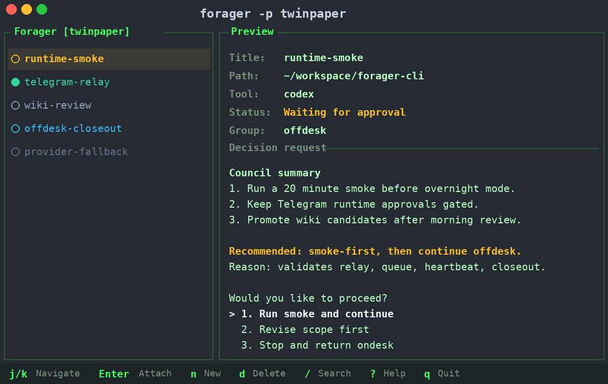

<p align="center">
  
  <h1 align="center">Forager</h1>
  <p align="center">
    <a href="https://kimyoungjin06.github.io/forager-cli/"></a>
    <a href="https://github.com/kimyoungjin06/forager-cli/actions/workflows/ci.yml"></a>
    <a href="LICENSE"></a>
    <a href="https://github.com/kimyoungjin06/forager-cli/releases"></a>
    <a href="https://blog.rust-lang.org/2023/11/16/Rust-1.74.0.html"></a>
    <a href="https://github.com/kimyoungjin06/forager-cli/stargazers"></a>
    <a href="https://kimyoungjin06.github.io/forager-cli/credits.html"></a>
  </p>
</p>

Offdesk agent orchestration with approvals, recovery, and audit trails. Built on tmux, written in Rust.

Run multiple AI agents in parallel across different branches of your codebase, each in its own isolated session. `aoe` remains available as a legacy compatibility alias while the project moves to `forager`.

> If you find this project useful, please consider giving it a star on GitHub: it helps others discover the project!



## Features

- **Multi-agent support** -- Claude Code, OpenCode, Mistral Vibe, Codex CLI, and Gemini CLI
- **TUI dashboard** -- visual interface to create, monitor, and manage sessions
- **Agent + terminal views** -- toggle between your AI agents and paired shell terminals with `t`
- **Status detection** -- see which agents are running, waiting for input, or idle
- **Git worktrees** -- run parallel agents on different branches of the same repo
- **Diff view** -- review git changes and edit files without leaving the TUI
- **Per-repo config** -- `.forager/config.toml` for project-specific settings and hooks, with `.aoe/config.toml` fallback
- **Profiles** -- separate workspaces for different projects or clients
- **Rename diagnostics** -- `forager doctor` shows active Forager paths and legacy AoE compatibility state
- **Safe AoE migration** -- `forager migrate aoe` copies legacy paths without overwriting Forager targets
- **Offdesk recovery** -- durable task queueing, approval retry, lifecycle recovery, and audit trails
- **Ondesk/Offdesk handoff** -- project initialization, prompt packages,
  launch dry runs, runtime approvals, closeout packets, and wiki review
  surfaces for longer autonomous work
- **CLI and TUI** -- full functionality from both interfaces

## How It Works

Forager wraps [tmux](https://github.com/tmux/tmux/wiki). Each session is a tmux session, so agents keep running when you close the TUI. Reopen `forager` and everything is still there.

The key tmux shortcut to know: **`Ctrl+b d`** detaches from a session and returns to the TUI.

## Installation

**Prerequisites:** [tmux](https://github.com/tmux/tmux/wiki) (required)

```bash
# Quick install (Linux & macOS)
curl -fsSL \
  https://raw.githubusercontent.com/kimyoungjin06/forager-cli/main/scripts/install.sh \
  | bash

# Build from source
git clone https://github.com/kimyoungjin06/forager-cli
cd forager && cargo build --release
```

The install script and release artifacts now use `forager` as the primary
command and keep `aoe` as a legacy alias during the transition.

## Quick Start

```bash
# Launch the TUI
forager

# Add a session from CLI
forager add /path/to/project

# Add a session on a new git branch
forager add . -w feat/my-feature -b

```

In the TUI: `n` to create a session, `Enter` to attach, `t` to toggle terminal view, `D` for diff view, `d` to delete, `?` for help.

## Documentation

- **[Installation](https://kimyoungjin06.github.io/forager-cli/docs/installation.html)** -- prerequisites and install methods
- **[Quick Start](https://kimyoungjin06.github.io/forager-cli/docs/quick-start.html)** -- first steps and basic usage
- **[Workflow Guide](https://kimyoungjin06.github.io/forager-cli/docs/guides/workflow.html)** -- recommended setup with bare repos and worktrees
- **[Operation Cycle](https://kimyoungjin06.github.io/forager-cli/docs/guides/operation-cycle.html)** -- Ondesk to Offdesk to Ondesk lifecycle, approvals, evidence, and wiki boundaries
- **[TwinPaper Offdesk Runtime Smoke](https://kimyoungjin06.github.io/forager-cli/docs/guides/twinpaper-offdesk-runtime-smoke.html)** -- validated short-run procedure for the approval-gated Offdesk launch path
- **[Repo Config & Hooks](https://kimyoungjin06.github.io/forager-cli/docs/guides/repo-config.html)** -- per-project settings and automation
- **[Configuration Reference](https://kimyoungjin06.github.io/forager-cli/docs/guides/configuration.html)** -- all config options
- **[CLI Reference](https://kimyoungjin06.github.io/forager-cli/docs/cli/reference.html)** -- complete command documentation

## FAQ

### What happens when I close Forager?

Nothing. Sessions are tmux sessions running in the background. Open and close `forager` as often as you like. Sessions only get removed when you explicitly delete them.

### Which AI tools are supported?

Claude Code, OpenCode, Mistral Vibe, Codex CLI, and Gemini CLI. Forager auto-detects which are installed on your system.

## Troubleshooting

### Using Forager with mobile SSH clients (Termius, Blink, etc.)

Run `forager` inside a tmux session when connecting from mobile:

```bash
tmux new-session -s main
forager
```

Use `Ctrl+b L` to toggle back to Forager after attaching to an agent session.

### Claude Code is flickering

This is a known Claude Code issue, not a Forager problem: https://github.com/anthropics/claude-code/issues/1913

## Development

```bash
cargo check          # Type-check
cargo test           # Run tests
cargo fmt            # Format
cargo clippy         # Lint
cargo build --release  # Release build

# Debug logging
FORAGER_DEBUG=1 cargo run --bin forager
```

## Star History

[](https://www.star-history.com/#kimyoungjin06/forager-cli&type=date&legend=top-left)

## Acknowledgments

Inspired by [agent-deck](https://github.com/asheshgoplani/agent-deck) (Go + Bubble Tea).

## License

MIT License -- see [LICENSE](LICENSE) for details.
